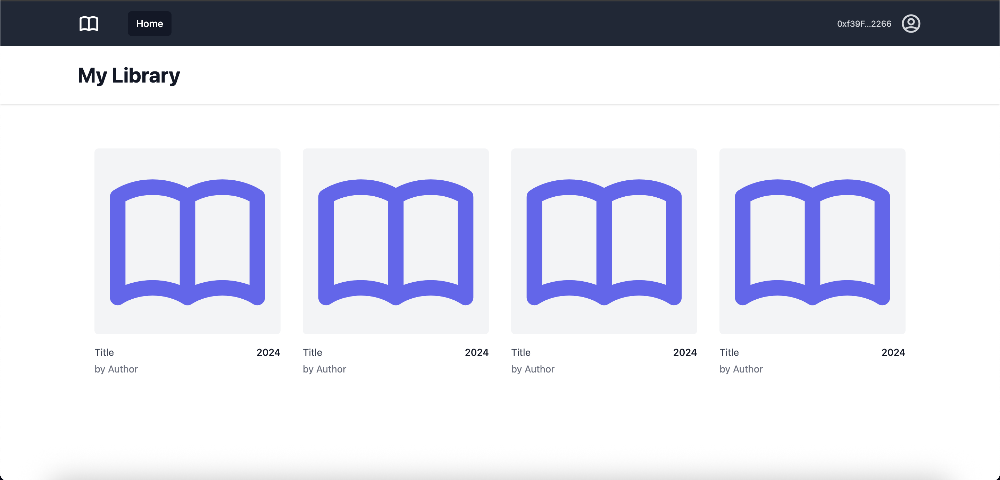

# Smart Lib

Simple library app powered by a Solidity `Library` contract and a Next.js frontend.

## Screenshot



## Requirements

- Node 24
- MetaMask browser extension

## Install

```
npm install
```

## Run locally (Hardhat + Next.js)

1) Start a local chain (Hardhat)

```
cd packages/contracts
npx hardhat node
```

2) In another terminal, deploy the contract to localhost (chainId 31337)

```
cd packages/contracts
npx hardhat run scripts/deploy.ts --network localhost
```

Copy the printed address, e.g. `0x5FbDB2315678afecb367f032d93F642f64180aa3`.

3) Point the app to that address

```
cd packages/app
echo "NEXT_PUBLIC_LIBRARY_CONTRACT_ADDRESS=0x5FbDB2315678afecb367f032d93F642f64180aa3" > .env.local
```

4) Start the app

From repo root:

```
npm run dev
```

Open `http://localhost:3000`.

## Connect MetaMask

1) Add the Localhost network (if missing)
- Network name: `Localhost 8545`
- RPC URL: `http://127.0.0.1:8545`
- Chain ID: `31337`
- Currency: `ETH`

2) Switch MetaMask to `Localhost 8545`

3) In the app header (avatar menu) click `Connect Wallet` and approve.

Tip: If you added books with a Hardhat test account, import that account’s private key into MetaMask so you see your own books.

## Add books (example via Hardhat console)

```
cd packages/contracts
npx hardhat console --network localhost
```

Then in the console:

```
const addr = '0x5FbDB2315678afecb367f032d93F642f64180aa3'
const lib = await ethers.getContractAt('Library', addr)
await lib.addBook('Title', 2024, 'Author', false)
```

Refresh the `/library` page to see the new entry.

## Scripts

- Dev (app):
  - `npm run dev` (runs Next.js in `packages/app`)
- Build/Start (app):
  - `npm run build -w packages/app`
  - `npm run start -w packages/app`

## Tests

```
npm run test -w packages/app
```